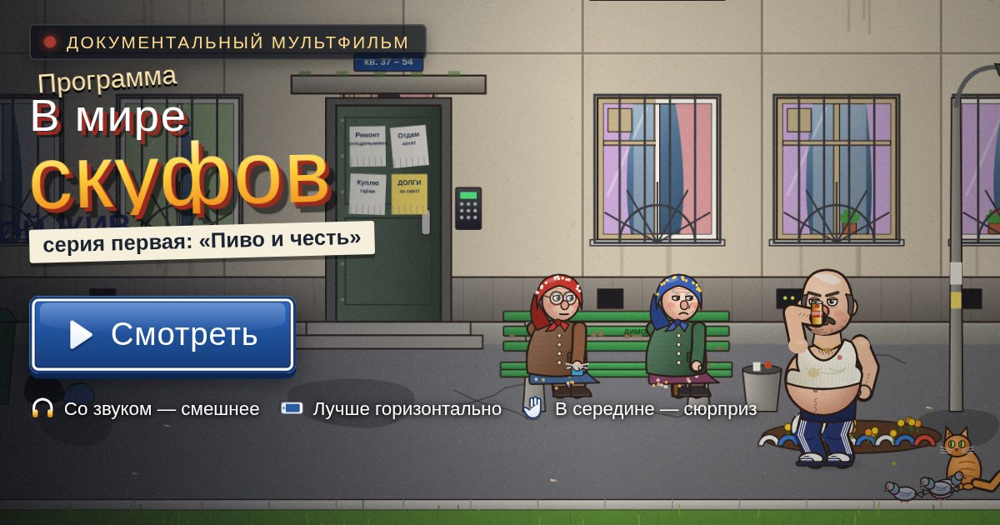

# В мире скуфов — мультфильм, нарисованный кодом

Документальный мультфильм в духе «В мире животных» про скуфа обыкновенного Гену,
бабушек у подъезда, гопников с хардбасом, кота Барсика и «семёрку» по имени Ласточка.
Около 6,5 минуты, русская озвучка, музыка, субтитры.



## Как запустить

Откройте `index.html` в браузере. Это всё: без React, без сборщиков, без сервера.
Работает и двойным кликом по файлу (`file://`), и с любого статического хостинга.

Если хочется через локальный сервер:

```bash
python3 -m http.server 8000
# и открыть http://localhost:8000
```

## Сюжет

1. **Пролог.** Рассвет над спальным районом, наезд камеры на окно.
2. **Пробуждение.** Гена зевает в окне, мама с балкона требует хлеба.
3. **Лавочка.** Домофон, баба Валя и баба Зина, которая знает одно слово.
4. **Водопой.** Перемотка ×4 до ларька: «Хлеба нет. Пиво есть».
5. **Ласточка.** ВАЗ-2107 не заводится с 2014 года.
6. **Брачный зов.** Гопники под хардбас, «Слышь, есть чё?», «Дядь Гена?!».
7. **Ритуал.** Вобла об капот, банку трясли во время хардбаса…
8. **Фича** (см. ниже).
9. **После бури**, **Пирожки**, титры и сцена после титров.

## Фича в середине

Пиво взрывается прямо в экран, капли стекают по «стеклу», мультфильм искрит,
кинескоп схлопывается в полоску, выскакивает окно ошибки
«Мультфильм.exe выполнил недопустимую операцию». Рука Гены хватает окно и выбрасывает его,
а под ним оказывается мир из кода: неоновый каркас, подписи объектов (`skuf.exe`, `vaz2107.obj`).

Дальше управление получает зритель.

- Персонажей можно хватать пальцем или мышью и бросать. У всех физика, столкновения, крики.
- На пульте 12 команд: гравитация (норма, ноль, вверх), **наклон телефона** (гравитацией
  управляет гироскоп), причёска Гены, пузо больше или меньше, режим больших голов,
  дискотека с зеркальным шаром, ночь, снег со снеговиком, сотня голубей, гигантский Гена, каркас.
- Гена в кадре обращается к зрителю по текущему времени суток (ночью, утром, днём, вечером
  реплики разные).
- Ничего не трогали 26 секунд? Мультфильм продолжится сам.

Потом «Ctrl+Z»: VHS-перемотка с реверсом голоса, и все летят на свои места.
Но причёску и пузо, которые выбрал зритель, Гена **оставляет до конца фильма**, и баба Валя это
замечает. Есть отдельные реплики на причёску, похудение и «отъелся». Гопник рисует на гараже
граффити «<ИМЯ> — РЕЖИССЁР» (имя берётся из профиля MAX), а в титрах зритель указан
режиссёром второй половины. Видео так не умеет.

## Управление

| Действие | Касание | Клавиатура |
|---|---|---|
| Пауза / продолжить | кнопка по центру | Пробел, K |
| Назад / вперёд на 10 с | кнопки по бокам | ← / → |
| Перемотка | полоса прогресса | — |
| Субтитры | CC | S |
| Звук | динамик | M |
| На весь экран | рамка | F |
| Пауза с меню | домик | Esc, P |

## Структура

```
index.html          — разметка экранов, SVG-иконки, подключение скриптов
css/style.css       — оформление: эмалированные таблички, отрывные объявления, билет
js/util.js          — математика, сглаживания, цвета, детерминированный случайный генератор
js/platform.js      — вёрстка под видимую область (поворот для вертикального телефона), MAX, сохранения, шаринг
js/audio.js         — Web Audio: эффекты (домофон, стартер, пшик банки, хардбас-«хэй»…), воспроизведение реплик
js/music.js         — синтезатор и секвенсор: баян, балалайка, флейта, гитара, хардбас, 8-бит
js/gfx.js           — обёртки рисования с каркасным режимом, IK для рук и ног
js/characters.js    — Гена, баба Валя, баба Зина, Вован, Колян, мама, кот, голуби
js/props.js         — пиво, вобла, пирожки, семки, телефон, ВАЗ-2107
js/sets.js          — двор панельки, гаражи, ларёк, площадка, небо и время суток
js/effects.js       — частицы, брызги на экране, глитч, VHS, виньетка, зерно
js/screenplay.js    — сценарий: такты, реплики, блокировка актёров и камеры
js/director.js      — таймлайн, синхронизация голоса и липсинк, субтитры, отрисовка кадра
js/feature.js       — песочница: физика, пульт, наклон, голуби, перемотка Ctrl+Z
js/ui.js            — меню, плеер, пауза, финальный «билет»
js/main.js          — запуск, кэш декораций, главный цикл, пауза при сворачивании
js/voice-meta.js    — тексты реплик, длительности и огибающие для липсинка (генерируется)
audio/voices.js     — 104 реплики в mp3 (base64), чтобы работало и с file:// (генерируется)
img/                — постер и иконки (отрендерены этим же движком)
tools/lines.py      — все реплики с ударениями и голоса персонажей
tools/gen_voices.py — генератор озвучки
```

Мультфильм устроен как чистая функция от времени: каждый кадр вычисляется по `T`,
поэтому перемотка работает в любую сторону. Рот персонажей открывается по реальной
громкости реплики, огибающая заранее посчитана при генерации.

## Озвучка

Голоса синтезированы движком RHVoice: 8 персонажей, у каждого свой голос и обработка в sox.
У бабушек дрожь в голосе, у мамы эхо из квартиры, у «Системы» роботизированный тембр.
Пересобрать озвучку после правки реплик в `tools/lines.py`:

```bash
sudo apt install rhvoice rhvoice-russian sox lame
pip install numpy
python3 tools/gen_voices.py
```

Если озвучка не загрузилась, мультфильм идёт с субтитрами.

## Платформа MAX

Подключены `max-web-app.js` и `max-games-sdk.js`. Мультфильм работает и без них.
Размер считается по видимой области вебвью (без `vh`/`vw`). В вертикальном положении телефона
кадр поворачивается горизонтально. Звук и музыка останавливаются, когда вкладка скрыта.
Настройки (звук, субтитры, место остановки) хранятся в `localStorage` под одним ключом.
Есть кнопки «Поделиться» и «Конфиденциальность». Рейтинга нет, потому что это мультфильм.
